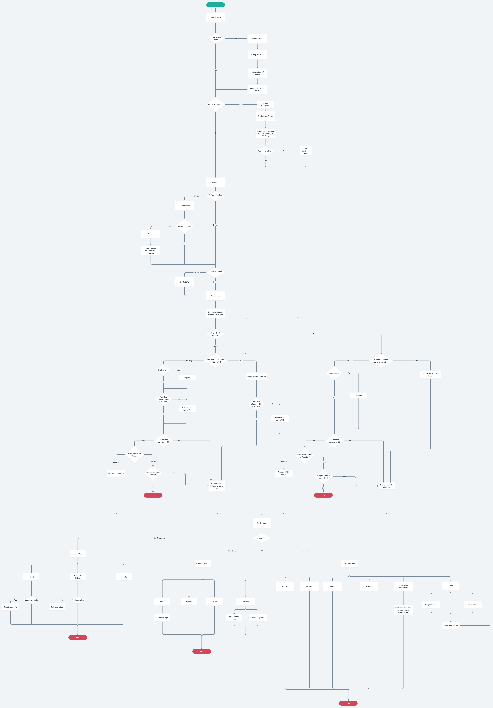

# Nutanix Database Service
Nutanix ansibe collection nutanix.ncp from v1.8.0 will contain modules for supporting Nutanix Database Service (NDB) features.

These modules are based on workflow :



Note: Access Control update in NDB is not yet supported.

## Usage
Below we will discuss usage of various NDB modules.

First, we need to configure NDB setup details in the plabook. This can be done either by using module_defaults or in each individual tasks.

```yaml
---
- name: NDB operations
  hosts: localhost
  gather_facts: false
  collections:
    - nutanix.ncp
  module_defaults:
    group/nutanix.ncp.ntnx:
      nutanix_host: <ndb_setup_ip>
      nutanix_username: <ndb_setup_username>
      nutanix_password: <ndb_setup_password>
      validate_certs: true
  tasks:
    - name: create tags
      ntnx_ndb_tags:
        nutanix_host: <ndb_setup_ip>
        nutanix_username: <ndb_setup_username>
        nutanix_password: <ndb_setup_password>
        validate_certs: true
```

Initially on NDB setup, we add cluster, vlans or stretched vlans.

For example, playbook task to register AHV cluster in NDB setup is :

```yaml
  - name: NDB cluster registration
    ntnx_ndb_clusters:
    name: "<name>"
    desc: "<description>"
    name_prefix: "<prefix_for_agent_vm>"
    cluster_ip: "<cluster's_ip_address>"
    cluster_credentials:
        username: "<username>"
        password: "<password>"
    agent_network:
        dns_servers:
        - "<dns_ip1>"
        - "<dns_ip2>"
        ntp_servers:
        - "<ntp_server_address1>"
        - "<ntp_server_address1>"
        - "<ntp_server_address1>"
        - "<ntp_server_address1>"
    vlan_access:
        prism_vlan:
            vlan_name: "<vlan_name_for_agent_vm>"
            vlan_type: "<vlan_type>"
            static_ip: "<ip_address_for_agent_vm>"
            gateway: "<vlan_gateway>"
            subnet_mask: "<subnet_mask>"
    storage_container: "<storage_container_name>"
    register: output
```

Examples for adding vlans and stretched vlans can be found in module documentation or examples/ndb/ in our GitHub repository.

Currently, we only support postgres type databases.

Example playbook task to deploy single instance postgres type database in NDB is :

```yaml
  - name: Create single instance postgres database
    ntnx_ndb_databases:
        name: POSTGRES_DATABASE_ANSIBLE
        db_params_profile:
            name: DEFAULT_POSTGRES_PARAMS
        db_vm:
            create_new_server:
                name: postgres_server_ansible
                password: temp_password
                cluster: 
                    name: TempCluster
                software_profile:
                    name: POSTGRES_10.4_OOB
                network_profile:
                    name: DEFAULT_OOB_POSTGRESQL_NETWORK
                compute_profile:
                    name: DEFAULT_OOB_SMALL_COMPUTE
                pub_ssh_key: "<publickey-for-vm-access>"
        
        postgres:
            listener_port: "5432"
            db_name: test_ansible
            db_password: db_password
            db_size: 200

        time_machine:
            name: POSTGRES_DATABASE_ANSIBLE_TM
            sla:
                name: "None"
```